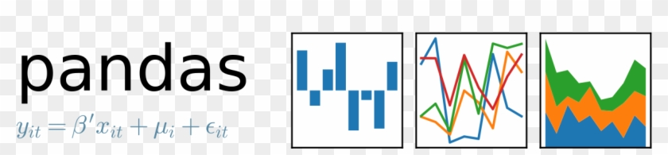

    
     
     
     

<h1 align="center">
    Awesome Python Data Science
</h1>

 

> Probably the best curated list of data science software in Python

## Contents
- [Contents](#contents)
- [Machine Learning](#machine-learning)
	- [General Purpose Machine Learning](#general-purpose-machine-learning)
  	- [Gradient Boosting](#gradient-boosting)
	- [Ensemble Methods](#ensemble-methods)
	- [Imbalanced Datasets](#imbalanced-datasets)
	- [Random Forests](#random-forests)
	- [Kernel Methods](#kernel-methods)
- [Deep Learning](#deep-learning)
	- [PyTorch](#pytorch)
	- [TensorFlow](#tensorflow)
 	- [JAX](#jax)
	- [Others](#others)
- [Automated Machine Learning](#automated-machine-learning)
- [Natural Language Processing](#natural-language-processing)
- [Computer Audition](#computer-audition)
- [Computer Vision](#computer-vision)
- [Time Series](#time-series)
- [Reinforcement Learning](#reinforcement-learning)
- [Graph Machine Learning](#graph-machine-learning)
- [Learning-to-Rank & Recommender Systems](#learning-to-rank-&-recommender-systems)
- [Probabilistic Graphical Models](#probabilistic-graphical-models)
- [Probabilistic Methods](#probabilistic-methods)
- [Model Explanation](#model-explanation)
- [Optimization](#optimization)
- [Genetic Programming](#genetic-programming)
- [Feature Engineering](#feature-engineering)
	- [General](#general)
	- [Feature Selection](#feature-selection)
- [Visualization](#visualization)
	- [General Purposes](#general-purposes)
	- [Interactive plots](#interactive-plots)
	- [Map](#map)
	- [Automatic Plotting](#automatic-plotting)
	- [NLP](#nlp)
- [Data Manipulation](#data-manipulation)
	- [Data Frames](#data-frames)
	- [Pipelines](#pipelines)
	- [Data-centric AI](#data-centric-ai)
	- [Synthetic Data](#synthetic-data)
- [Deployment](#deployment)
- [Statistics](#statistics)
- [Distributed Computing](#distributed-computing)
- [Experimentation](#experimentation)
- [Data Validation](#data-validation)
- [Evaluation](#evaluation)
- [Computations](#computations)
- [Web Scraping](#web-scraping)
- [Spatial Analysis](#spatial-analysis)
- [Quantum Computing](#quantum-computing)
- [Conversion](#conversion)
- [Contributing](#contributing)
- [License](#license)

## Machine Learning

### General Purpose Machine Learning
* [scikit-learn](http://scikit-learn.org/stable/) - Machine learning in Python. 
* [PyCaret](https://github.com/pycaret/pycaret) - An open-source, low-code machine learning library in Python.  
* [Shogun](https://github.com/shogun-toolbox/shogun) - Machine learning toolbox.
* [xLearn](https://github.com/aksnzhy/xlearn) - High Performance, Easy-to-use, and Scalable Machine Learning Package.
* [cuML](https://github.com/rapidsai/cuml) - RAPIDS Machine Learning Library.  
* [modAL](https://github.com/cosmic-cortex/modAL) - Modular active learning framework for Python3. 
* [Sparkit-learn](https://github.com/lensacom/sparkit-learn) - PySpark + scikit-learn = Sparkit-learn.  
* [mlpack](https://github.com/mlpack/mlpack) - A scalable C++ machine learning library (Python bindings).
* [dlib](https://github.com/davisking/dlib) - Toolkit for making real-world machine learning and data analysis applications in C++ (Python bindings).
* [MLxtend](https://github.com/rasbt/mlxtend) - Extension and helper modules for Python's data analysis and machine learning libraries. 
* [hyperlearn](https://github.com/danielhanchen/hyperlearn) - 50%+ Faster, 50%+ less RAM usage, GPU support re-written Sklearn, Statsmodels.  
* [Reproducible Experiment Platform (REP)](https://github.com/yandex/rep) - Machine Learning toolbox for Humans. 
* [scikit-multilearn](https://github.com/scikit-multilearn/scikit-multilearn) - Multi-label classification for python. 
* [seqlearn](https://github.com/larsmans/seqlearn) - Sequence classification toolkit for Python. 
* [pystruct](https://github.com/pystruct/pystruct) - Simple structured learning framework for Python. 
* [sklearn-expertsys](https://github.com/tmadl/sklearn-expertsys) - Highly interpretable classifiers for scikit learn. 
* [RuleFit](https://github.com/christophM/rulefit) - Implementation of the rulefit. 
* [metric-learn](https://github.com/all-umass/metric-learn) - Metric learning algorithms in Python. 
* [pyGAM](https://github.com/dswah/pyGAM) - Generalized Additive Models in Python.
* [causalml](https://github.com/uber/causalml) - Uplift modeling and causal inference with machine learning algorithms. 

### Gradient Boosting
* [XGBoost](https://github.com/dmlc/xgboost) - Scalable, Portable, and Distributed Gradient Boosting.  
* [LightGBM](https://github.com/Microsoft/LightGBM) - A fast, distributed, high-performance gradient boosting.  
* [CatBoost](https://github.com/catboost/catboost) - An open-source gradient boosting on decision trees library.  
* [ThunderGBM](https://github.com/Xtra-Computing/thundergbm) - Fast GBDTs and Random Forests on GPUs.  
* [NGBoost](https://github.com/stanfordmlgroup/ngboost) - Natural Gradient Boosting for Probabilistic Prediction.
* [TensorFlow Decision Forests](https://github.com/tensorflow/decision-forests) - A collection of state-of-the-art algorithms for the training, serving and interpretation of Decision Forest models in Keras.  

### Ensemble Methods
* [ML-Ensemble](http://ml-ensemble.com/) - High performance ensemble learning. 
* [Stacking](https://github.com/ikki407/stacking) - Simple and useful stacking library written in Python. 
* [stacked_generalization](https://github.com/fukatani/stacked_generalization) - Library for machine learning stacking generalization. 
* [vecstack](https://github.com/vecxoz/vecstack) - Python package for stacking (machine learning technique). 

### Imbalanced Datasets
* [imbalanced-learn](https://github.com/scikit-learn-contrib/imbalanced-learn) - Module to perform under-sampling and over-sampling with various techniques. 
* [imbalanced-algorithms](https://github.com/dialnd/imbalanced-algorithms) - Python-based implementations of algorithms for learning on imbalanced data.  

### Random Forests
* [rpforest](https://github.com/lyst/rpforest) - A forest of random projection trees. 
* [sklearn-random-bits-forest](https://github.com/tmadl/sklearn-random-bits-forest) - Wrapper of the Random Bits Forest program written by (Wang et al., 2016).
* [rgf_python](https://github.com/fukatani/rgf_python) - Python Wrapper of Regularized Greedy Forest. 

### Kernel Methods
* [pyFM](https://github.com/coreylynch/pyFM) - Factorization machines in python. 
* [fastFM](https://github.com/ibayer/fastFM) - A library for Factorization Machines. 
* [tffm](https://github.com/geffy/tffm) - TensorFlow implementation of an arbitrary order Factorization Machine.  
* [liquidSVM](https://github.com/liquidSVM/liquidSVM) - An implementation of SVMs.
* [scikit-rvm](https://github.com/JamesRitchie/scikit-rvm) - Relevance Vector Machine implementation using the scikit-learn API. 
* [ThunderSVM](https://github.com/Xtra-Computing/thundersvm) - A fast SVM Library on GPUs and CPUs.  

## Deep Learning

### PyTorch
* [PyTorch](https://github.com/pytorch/pytorch) - Tensors and Dynamic neural networks in Python with strong GPU acceleration. 
* [pytorch-lightning](https://github.com/Lightning-AI/lightning) - PyTorch Lightning is just organized PyTorch. 
* [ignite](https://github.com/pytorch/ignite) - High-level library to help with training neural networks in PyTorch. 
* [skorch](https://github.com/dnouri/skorch) - A scikit-learn compatible neural network library that wraps PyTorch.  
* [Catalyst](https://github.com/catalyst-team/catalyst) - High-level utils for PyTorch DL & RL research. 
* [ChemicalX](https://github.com/AstraZeneca/chemicalx) - A PyTorch-based deep learning library for drug pair scoring. 

### TensorFlow
* [TensorFlow](https://github.com/tensorflow/tensorflow) - Computation using data flow graphs for scalable machine learning by Google. 
* [TensorLayer](https://github.com/zsdonghao/tensorlayer) - Deep Learning and Reinforcement Learning Library for Researcher and Engineer. 
* [TFLearn](https://github.com/tflearn/tflearn) - Deep learning library featuring a higher-level API for TensorFlow. 
* [Sonnet](https://github.com/deepmind/sonnet) - TensorFlow-based neural network library. 
* [tensorpack](https://github.com/ppwwyyxx/tensorpack) - A Neural Net Training Interface on TensorFlow. 
* [Polyaxon](https://github.com/polyaxon/polyaxon) - A platform that helps you build, manage and monitor deep learning models. 
* [tfdeploy](https://github.com/riga/tfdeploy) - Deploy TensorFlow graphs for fast evaluation and export to TensorFlow-less environments running numpy. 
* [tensorflow-upstream](https://github.com/ROCmSoftwarePlatform/tensorflow-upstream) - TensorFlow ROCm port.  
* [TensorFlow Fold](https://github.com/tensorflow/fold) - Deep learning with dynamic computation graphs in TensorFlow. 
* [TensorLight](https://github.com/bsautermeister/tensorlight) - A high-level framework for TensorFlow. 
* [Mesh TensorFlow](https://github.com/tensorflow/mesh) - Model Parallelism Made Easier. 
* [Ludwig](https://github.com/uber/ludwig) - A toolbox that allows one to train and test deep learning models without the need to write code. 
* [Keras](https://keras.io) - A high-level neural networks API running on top of TensorFlow.  
* [keras-contrib](https://github.com/keras-team/keras-contrib) - Keras community contributions. 
* [Hyperas](https://github.com/maxpumperla/hyperas) - Keras + Hyperopt: A straightforward wrapper for a convenient hyperparameter. 
* [Elephas](https://github.com/maxpumperla/elephas) - Distributed Deep learning with Keras & Spark. 
* [qkeras](https://github.com/google/qkeras) - A quantization deep learning library. 

### JAX
* [JAX](https://github.com/google/jax) - Composable transformations of Python+NumPy programs: differentiate, vectorize, JIT to GPU/TPU, and more.
* [FLAX](https://github.com/google/flax) - A neural network library for JAX that is designed for flexibility.
* [Optax](https://github.com/google-deepmind/optax) - A gradient processing and optimization library for JAX.

### Others
* [transformers](https://github.com/huggingface/transformers) - State-of-the-art Machine Learning for Pytorch, TensorFlow, and JAX.  
* [Tangent](https://github.com/google/tangent) - Source-to-Source Debuggable Derivatives in Pure Python.
* [autograd](https://github.com/HIPS/autograd) - Efficiently computes derivatives of numpy code.
* [Caffe](https://github.com/BVLC/caffe) - A fast open framework for deep learning.
* [nnabla](https://github.com/sony/nnabla) - Neural Network Libraries by Sony.

## Automated Machine Learning
* [auto-sklearn](https://github.com/automl/auto-sklearn) - An AutoML toolkit and a drop-in replacement for a scikit-learn estimator. 
* [Auto-PyTorch](https://github.com/automl/Auto-PyTorch) - Automatic architecture search and hyperparameter optimization for PyTorch. 
* [AutoKeras](https://github.com/keras-team/autokeras) - AutoML library for deep learning. 
* [AutoGluon](https://github.com/awslabs/autogluon) - AutoML for Image, Text, Tabular, Time-Series, and MultiModal Data.
* [TPOT](https://github.com/rhiever/tpot) - AutoML tool that optimizes machine learning pipelines using genetic programming. 
* [MLBox](https://github.com/AxeldeRomblay/MLBox) - A powerful Automated Machine Learning python library.

## Natural Language Processing
* [torchtext](https://github.com/pytorch/text) - Data loaders and abstractions for text and NLP. 
* [KerasNLP](https://github.com/keras-team/keras-nlp) - Modular Natural Language Processing workflows with Keras. 
* [spaCy](https://spacy.io/) - Industrial-Strength Natural Language Processing.
* [NLTK](https://github.com/nltk/nltk) -  Modules, data sets, and tutorials supporting research and development in Natural Language Processing.
* [CLTK](https://github.com/cltk/cltk) - The Classical Language Toolkik.
* [gensim](https://radimrehurek.com/gensim/) - Topic Modelling for Humans.
* [pyMorfologik](https://github.com/dmirecki/pyMorfologik) - Python binding for <a href="https://github.com/morfologik/morfologik-stemming">Morfologik</a>.
* [skift](https://github.com/shaypal5/skift) - Scikit-learn wrappers for Python fastText. 
* [Phonemizer](https://github.com/bootphon/phonemizer) - Simple text-to-phonemes converter for multiple languages.
* [flair](https://github.com/zalandoresearch/flair) - Very simple framework for state-of-the-art NLP.

## Computer Audition
* [torchaudio](https://github.com/pytorch/audio) - An audio library for PyTorch. 
* [librosa](https://github.com/librosa/librosa) - Python library for audio and music analysis.
* [Yaafe](https://github.com/Yaafe/Yaafe) - Audio features extraction.
* [aubio](https://github.com/aubio/aubio) - A library for audio and music analysis.
* [Essentia](https://github.com/MTG/essentia) - Library for audio and music analysis, description, and synthesis.
* [LibXtract](https://github.com/jamiebullock/LibXtract) - A simple, portable, lightweight library of audio feature extraction functions.
* [Marsyas](https://github.com/marsyas/marsyas) - Music Analysis, Retrieval, and Synthesis for Audio Signals.
* [muda](https://github.com/bmcfee/muda) - A library for augmenting annotated audio data.
* [madmom](https://github.com/CPJKU/madmom) - Python audio and music signal processing library.

## Computer Vision
* [torchvision](https://github.com/pytorch/vision) - Datasets, Transforms, and Models specific to Computer Vision. 
* [PyTorch3D](https://github.com/facebookresearch/pytorch3d) - PyTorch3D is FAIR's library of reusable components for deep learning with 3D data. 
* [KerasCV](https://github.com/keras-team/keras-cv) - Industry-strength Computer Vision workflows with Keras. 
* [OpenCV](https://github.com/opencv/opencv) - Open Source Computer Vision Library.
* [Decord](https://github.com/dmlc/decord) - An efficient video loader for deep learning with smart shuffling that's super easy to digest.
* [MMEngine](https://github.com/open-mmlab/mmengine) - OpenMMLab Foundational Library for Training Deep Learning Models. 
* [scikit-image](https://github.com/scikit-image/scikit-image) - Image Processing SciKit (Toolbox for SciPy).
* [imgaug](https://github.com/aleju/imgaug) - Image augmentation for machine learning experiments.
* [imgaug_extension](https://github.com/cadenai/imgaug_extension) - Additional augmentations for imgaug.
* [Augmentor](https://github.com/mdbloice/Augmentor) - Image augmentation library in Python for machine learning.
* [albumentations](https://github.com/albu/albumentations) - Fast image augmentation library and easy-to-use wrapper around other libraries.
* [LAVIS](https://github.com/salesforce/LAVIS) - A One-stop Library for Language-Vision Intelligence.

## Time Series
* [sktime](https://github.com/alan-turing-institute/sktime) - A unified framework for machine learning with time series. 
* [skforecast](https://github.com/JoaquinAmatRodrigo/skforecast) - Time series forecasting with machine learning models
* [darts](https://github.com/unit8co/darts) - A python library for easy manipulation and forecasting of time series.
* [statsforecast](https://github.com/Nixtla/statsforecast) - Lightning fast forecasting with statistical and econometric models.
* [mlforecast](https://github.com/Nixtla/mlforecast) - Scalable machine learning-based time series forecasting.
* [neuralforecast](https://github.com/Nixtla/neuralforecast) - Scalable machine learning-based time series forecasting.
* [tslearn](https://github.com/rtavenar/tslearn) - Machine learning toolkit dedicated to time-series data. 
* [tick](https://github.com/X-DataInitiative/tick) - Module for statistical learning, with a particular emphasis on time-dependent modeling.  
* [greykite](https://github.com/linkedin/greykite) - A flexible, intuitive, and fast forecasting library next.
* [Prophet](https://github.com/facebook/prophet) - Automatic Forecasting Procedure.
* [PyFlux](https://github.com/RJT1990/pyflux) - Open source time series library for Python.
* [bayesloop](https://github.com/christophmark/bayesloop) - Probabilistic programming framework that facilitates objective model selection for time-varying parameter models.
* [luminol](https://github.com/linkedin/luminol) - Anomaly Detection and Correlation library.
* [dateutil](https://dateutil.readthedocs.io/en/stable/) - Powerful extensions to the standard datetime module
* [maya](https://github.com/timofurrer/maya) - makes it very easy to parse a string and for changing timezones
* [Chaos Genius](https://github.com/chaos-genius/chaos_genius) - ML powered analytics engine for outlier/anomaly detection and root cause analysis

## Reinforcement Learning
* [Gymnasium](https://github.com/Farama-Foundation/Gymnasium) - An API standard for single-agent reinforcement learning environments, with popular reference environments and related utilities (formerly [Gym](https://github.com/openai/gym)).
* [PettingZoo](https://github.com/Farama-Foundation/PettingZoo) - An API standard for multi-agent reinforcement learning environments, with popular reference environments and related utilities.
* [MAgent2](https://github.com/Farama-Foundation/MAgent2) - An engine for high performance multi-agent environments with very large numbers of agents, along with a set of reference environments.
* [Stable Baselines3](https://github.com/DLR-RM/stable-baselines3) - A set of improved implementations of reinforcement learning algorithms based on OpenAI Baselines.
* [Shimmy](https://github.com/Farama-Foundation/Shimmy) - An API conversion tool for popular external reinforcement learning environments.
* [EnvPool](https://github.com/sail-sg/envpool) - C++-based high-performance parallel environment execution engine (vectorized env) for general RL environments.
* [RLlib](https://ray.readthedocs.io/en/latest/rllib.html) - Scalable Reinforcement Learning.
* [Tianshou](https://github.com/thu-ml/tianshou/#comprehensive-functionality) - An elegant PyTorch deep reinforcement learning library. 
* [Acme](https://github.com/google-deepmind/acme) - A library of reinforcement learning components and agents.
* [Catalyst-RL](https://github.com/catalyst-team/catalyst-rl) - PyTorch framework for RL research. 
* [d3rlpy](https://github.com/takuseno/d3rlpy) - An offline deep reinforcement learning library.
* [DI-engine](https://github.com/opendilab/DI-engine) - OpenDILab Decision AI Engine. 
* [TF-Agents](https://github.com/tensorflow/agents) - A library for Reinforcement Learning in TensorFlow. 
* [TensorForce](https://github.com/reinforceio/tensorforce) - A TensorFlow library for applied reinforcement learning. 
* [TRFL](https://github.com/deepmind/trfl) - TensorFlow Reinforcement Learning. 
* [Dopamine](https://github.com/google/dopamine) - A research framework for fast prototyping of reinforcement learning algorithms.
* [keras-rl](https://github.com/keras-rl/keras-rl) - Deep Reinforcement Learning for Keras. 
* [garage](https://github.com/rlworkgroup/garage) - A toolkit for reproducible reinforcement learning research.
* [Horizon](https://github.com/facebookresearch/Horizon) - A platform for Applied Reinforcement Learning.
* [rlpyt](https://github.com/astooke/rlpyt) - Reinforcement Learning in PyTorch. 
* [cleanrl](https://github.com/vwxyzjn/cleanrl) - High-quality single file implementation of Deep Reinforcement Learning algorithms with research-friendly features (PPO, DQN, C51, DDPG, TD3, SAC, PPG).
* [Machin](https://github.com/iffiX/machin) -  A reinforcement library designed for pytorch. 
* [SKRL](https://github.com/Toni-SM/skrl) - Modular reinforcement learning library (on PyTorch and JAX) with support for NVIDIA Isaac Gym, Isaac Orbit and Omniverse Isaac Gym. 
* [Imitation](https://github.com/HumanCompatibleAI/imitation) - Clean PyTorch implementations of imitation and reward learning algorithms. 

## Graph Machine Learning
* [pytorch_geometric](https://github.com/rusty1s/pytorch_geometric) - Geometric Deep Learning Extension Library for PyTorch. 
* [pytorch_geometric_temporal](https://github.com/benedekrozemberczki/pytorch_geometric_temporal) - Temporal Extension Library for PyTorch Geometric. 
* [PyTorch Geometric Signed Directed](https://github.com/SherylHYX/pytorch_geometric_signed_directed) -  A signed/directed graph neural network extension library for PyTorch Geometric. 
* [dgl](https://github.com/dmlc/dgl) - Python package built to ease deep learning on graph, on top of existing DL frameworks.   
* [Spektral](https://github.com/danielegrattarola/spektral) - Deep learning on graphs. 
* [StellarGraph](https://github.com/stellargraph/stellargraph) - Machine Learning on Graphs.   
* [Graph Nets](https://github.com/google-deepmind/graph_nets) - Build Graph Nets in Tensorflow. 
* [TensorFlow GNN](https://github.com/tensorflow/gnn) - A library to build Graph Neural Networks on the TensorFlow platform. 
* [Auto Graph Learning](https://github.com/THUMNLab/AutoGL) -An autoML framework & toolkit for machine learning on graphs.
* [PyTorch-BigGraph](https://github.com/facebookresearch/PyTorch-BigGraph) - Generate embeddings from large-scale graph-structured data. 
* [Auto Graph Learning](https://github.com/THUMNLab/AutoGL) - An autoML framework & toolkit for machine learning on graphs.
* [Karate Club](https://github.com/benedekrozemberczki/karateclub) - An unsupervised machine learning library for graph-structured data.
* [Little Ball of Fur](https://github.com/benedekrozemberczki/littleballoffur) - A library for sampling graph structured data.
* [GreatX](https://github.com/EdisonLeeeee/GreatX) - A graph reliability toolbox based on PyTorch and PyTorch Geometric (PyG). 
* [Jraph](https://github.com/google-deepmind/jraph) - A Graph Neural Network Library in Jax.

## Learning-to-Rank & Recommender Systems
* [LightFM](https://github.com/lyst/lightfm) - A Python implementation of LightFM, a hybrid recommendation algorithm.
* [Spotlight](https://maciejkula.github.io/spotlight/) - Deep recommender models using PyTorch.
* [Surprise](https://github.com/NicolasHug/Surprise) - A Python scikit for building and analyzing recommender systems.
* [RecBole](https://github.com/RUCAIBox/RecBole) - A unified, comprehensive and efficient recommendation library. 
* [allRank](https://github.com/allegro/allRank) - allRank is a framework for training learning-to-rank neural models based on PyTorch. 
* [TensorFlow Recommenders](https://github.com/tensorflow/recommenders) - A library for building recommender system models using TensorFlow.  
* [TensorFlow Ranking](https://github.com/tensorflow/ranking) - Learning to Rank in TensorFlow.  

## Probabilistic Graphical Models
* [pomegranate](https://github.com/jmschrei/pomegranate) - Probabilistic and graphical models for Python. 
* [pgmpy](https://github.com/pgmpy/pgmpy) - A python library for working with Probabilistic Graphical Models.
* [pyAgrum](https://agrum.gitlab.io/) - A GRaphical Universal Modeler.

## Probabilistic Methods
* [pyro](https://github.com/uber/pyro) - A flexible, scalable deep probabilistic programming library built on PyTorch. 
* [PyMC](https://github.com/pymc-devs/pymc) - Bayesian Stochastic Modelling in Python.
* [ZhuSuan](http://zhusuan.readthedocs.io/en/latest/) - Bayesian Deep Learning. 
* [GPflow](http://gpflow.readthedocs.io/en/latest/?badge=latest) - Gaussian processes in TensorFlow. 
* [InferPy](https://github.com/PGM-Lab/InferPy) - Deep Probabilistic Modelling Made Easy.  
* [PyStan](https://github.com/stan-dev/pystan) - Bayesian inference using the No-U-Turn sampler (Python interface).
* [sklearn-bayes](https://github.com/AmazaspShumik/sklearn-bayes) - Python package for Bayesian Machine Learning with scikit-learn API. 
* [skpro](https://github.com/alan-turing-institute/skpro) - Supervised domain-agnostic prediction framework for probabilistic modelling by [The Alan Turing Institute](https://www.turing.ac.uk/). 
* [PyVarInf](https://github.com/ctallec/pyvarinf) - Bayesian Deep Learning methods with Variational Inference for PyTorch. 
* [emcee](https://github.com/dfm/emcee) - The Python ensemble sampling toolkit for affine-invariant MCMC.
* [hsmmlearn](https://github.com/jvkersch/hsmmlearn) - A library for hidden semi-Markov models with explicit durations.
* [pyhsmm](https://github.com/mattjj/pyhsmm) - Bayesian inference in HSMMs and HMMs.
* [GPyTorch](https://github.com/cornellius-gp/gpytorch) - A highly efficient and modular implementation of Gaussian Processes in PyTorch. 
* [sklearn-crfsuite](https://github.com/TeamHG-Memex/sklearn-crfsuite) - A scikit-learn-inspired API for CRFsuite. 

## Model Explanation

* [dalex](https://github.com/ModelOriented/DALEX) - moDel Agnostic Language for Exploration and explanation. 
* [Shapley](https://github.com/benedekrozemberczki/shapley) - A data-driven framework to quantify the value of classifiers in a machine learning ensemble.
* [Alibi](https://github.com/SeldonIO/alibi) - Algorithms for monitoring and explaining machine learning models.
* [anchor](https://github.com/marcotcr/anchor) - Code for "High-Precision Model-Agnostic Explanations" paper.
* [aequitas](https://github.com/dssg/aequitas) - Bias and Fairness Audit Toolkit.
* [Contrastive Explanation](https://github.com/MarcelRobeer/ContrastiveExplanation) - Contrastive Explanation (Foil Trees). 
* [yellowbrick](https://github.com/DistrictDataLabs/yellowbrick) - Visual analysis and diagnostic tools to facilitate machine learning model selection. 
* [scikit-plot](https://github.com/reiinakano/scikit-plot) - An intuitive library to add plotting functionality to scikit-learn objects. 
* [shap](https://github.com/slundberg/shap) - A unified approach to explain the output of any machine learning model. 
* [ELI5](https://github.com/TeamHG-Memex/eli5) - A library for debugging/inspecting machine learning classifiers and explaining their predictions.
* [Lime](https://github.com/marcotcr/lime) - Explaining the predictions of any machine learning classifier. 
* [FairML](https://github.com/adebayoj/fairml) - FairML is a python toolbox auditing the machine learning models for bias. 
* [L2X](https://github.com/Jianbo-Lab/L2X) - Code for replicating the experiments in the paper *Learning to Explain: An Information-Theoretic Perspective on Model Interpretation*.
* [PDPbox](https://github.com/SauceCat/PDPbox) - Partial dependence plot toolbox.
* [PyCEbox](https://github.com/AustinRochford/PyCEbox) - Python Individual Conditional Expectation Plot Toolbox.
* [Skater](https://github.com/datascienceinc/Skater) - Python Library for Model Interpretation.
* [model-analysis](https://github.com/tensorflow/model-analysis) - Model analysis tools for TensorFlow. 
* [themis-ml](https://github.com/cosmicBboy/themis-ml) - A library that implements fairness-aware machine learning algorithms. 
* [treeinterpreter](https://github.com/andosa/treeinterpreter) - Interpreting scikit-learn's decision tree and random forest predictions. 
* [AI Explainability 360](https://github.com/IBM/AIX360) - Interpretability and explainability of data and machine learning models.
* [Auralisation](https://github.com/keunwoochoi/Auralisation) - Auralisation of learned features in CNN (for audio).
* [CapsNet-Visualization](https://github.com/bourdakos1/CapsNet-Visualization) - A visualization of the CapsNet layers to better understand how it works.
* [lucid](https://github.com/tensorflow/lucid) - A collection of infrastructure and tools for research in neural network interpretability.
* [Netron](https://github.com/lutzroeder/Netron) - Visualizer for deep learning and machine learning models (no Python code, but visualizes models from most Python Deep Learning frameworks).
* [FlashLight](https://github.com/dlguys/flashlight) - Visualization Tool for your NeuralNetwork.
* [tensorboard-pytorch](https://github.com/lanpa/tensorboard-pytorch) - Tensorboard for PyTorch (and chainer, mxnet, numpy, ...).

## Genetic Programming
* [gplearn](https://github.com/trevorstephens/gplearn) - Genetic Programming in Python. 
* [PyGAD](https://github.com/ahmedfgad/GeneticAlgorithmPython) - Genetic Algorithm in Python.  
* [DEAP](https://github.com/DEAP/deap) - Distributed Evolutionary Algorithms in Python.
* [karoo_gp](https://github.com/kstaats/karoo_gp) - A Genetic Programming platform for Python with GPU support. 
* [monkeys](https://github.com/hchasestevens/monkeys) - A strongly-typed genetic programming framework for Python.
* [sklearn-genetic](https://github.com/manuel-calzolari/sklearn-genetic) - Genetic feature selection module for scikit-learn. 

## Optimization
* [Optuna](https://github.com/optuna/optuna) - A hyperparameter optimization framework.
* [pymoo](https://github.com/anyoptimization/pymoo) - Multi-objective Optimization in Python.
* [pycma](https://github.com/CMA-ES/pycma?tab=readme-ov-file) - Python implementation of CMA-ES.
* [Spearmint](https://github.com/HIPS/Spearmint) - Bayesian optimization.
* [BoTorch](https://github.com/pytorch/botorch) - Bayesian optimization in PyTorch. 
* [scikit-opt](https://github.com/guofei9987/scikit-opt) - Heuristic Algorithms for optimization.
* [sklearn-genetic-opt](https://github.com/rodrigo-arenas/Sklearn-genetic-opt) - Hyperparameters tuning and feature selection using evolutionary algorithms. 
* [SMAC3](https://github.com/automl/SMAC3) - Sequential Model-based Algorithm Configuration.
* [Optunity](https://github.com/claesenm/optunity) - Is a library containing various optimizers for hyperparameter tuning.
* [hyperopt](https://github.com/hyperopt/hyperopt) - Distributed Asynchronous Hyperparameter Optimization in Python.
* [hyperopt-sklearn](https://github.com/hyperopt/hyperopt-sklearn) - Hyper-parameter optimization for sklearn. 
* [sklearn-deap](https://github.com/rsteca/sklearn-deap) - Use evolutionary algorithms instead of gridsearch in scikit-learn. 
* [sigopt_sklearn](https://github.com/sigopt/sigopt_sklearn) - SigOpt wrappers for scikit-learn methods. 
* [Bayesian Optimization](https://github.com/fmfn/BayesianOptimization) - A Python implementation of global optimization with gaussian processes.
* [SafeOpt](https://github.com/befelix/SafeOpt) - Safe Bayesian Optimization.
* [scikit-optimize](https://github.com/scikit-optimize/scikit-optimize) - Sequential model-based optimization with a `scipy.optimize` interface.
* [Solid](https://github.com/100/Solid) - A comprehensive gradient-free optimization framework written in Python.
* [PySwarms](https://github.com/ljvmiranda921/pyswarms) - A research toolkit for particle swarm optimization in Python.
* [Platypus](https://github.com/Project-Platypus/Platypus) - A Free and Open Source Python Library for Multiobjective Optimization.
* [GPflowOpt](https://github.com/GPflow/GPflowOpt) - Bayesian Optimization using GPflow. 
* [POT](https://github.com/rflamary/POT) - Python Optimal Transport library.
* [Talos](https://github.com/autonomio/talos) - Hyperparameter Optimization for Keras Models.
* [nlopt](https://github.com/stevengj/nlopt) - Library for nonlinear optimization (global and local, constrained or unconstrained).
* [OR-Tools](https://developers.google.com/optimization) - An open-source software suite for optimization by Google; provides a unified programming interface to a half dozen solvers: SCIP, GLPK, GLOP, CP-SAT, CPLEX, and Gurobi.

## Feature Engineering

### General
* [Featuretools](https://github.com/Featuretools/featuretools) - Automated feature engineering.
* [Feature Engine](https://github.com/feature-engine/feature_engine) - Feature engineering package with sklearn-like functionality. 
* [OpenFE](https://github.com/IIIS-Li-Group/OpenFE) - Automated feature generation with expert-level performance.
* [skl-groups](https://github.com/dougalsutherland/skl-groups) - A scikit-learn addon to operate on set/"group"-based features. 
* [Feature Forge](https://github.com/machinalis/featureforge) - A set of tools for creating and testing machine learning features. 
* [few](https://github.com/lacava/few) - A feature engineering wrapper for sklearn. 
* [scikit-mdr](https://github.com/EpistasisLab/scikit-mdr) - A sklearn-compatible Python implementation of Multifactor Dimensionality Reduction (MDR) for feature construction. 
* [tsfresh](https://github.com/blue-yonder/tsfresh) - Automatic extraction of relevant features from time series. 
* [dirty_cat](https://github.com/dirty-cat/dirty_cat) - Machine learning on dirty tabular data (especially: string-based variables for classifcation and regression). 
* [NitroFE](https://github.com/NITRO-AI/NitroFE) - Moving window features. 
* [sk-transformer](https://github.com/chrislemke/sk-transformers) - A collection of various pandas & scikit-learn compatible transformers for all kinds of preprocessing and feature engineering steps 

### Feature Selection
* [scikit-feature](https://github.com/jundongl/scikit-feature) - Feature selection repository in Python.
* [boruta_py](https://github.com/scikit-learn-contrib/boruta_py) - Implementations of the Boruta all-relevant feature selection method. 
* [BoostARoota](https://github.com/chasedehan/BoostARoota) - A fast xgboost feature selection algorithm. 
* [scikit-rebate](https://github.com/EpistasisLab/scikit-rebate) - A scikit-learn-compatible Python implementation of ReBATE, a suite of Relief-based feature selection algorithms for Machine Learning. 
* [zoofs](https://github.com/jaswinder9051998/zoofs) - A feature selection library based on evolutionary algorithms.

## Visualization
### General Purposes
* [Matplotlib](https://github.com/matplotlib/matplotlib) - Plotting with Python.
* [seaborn](https://github.com/mwaskom/seaborn) - Statistical data visualization using matplotlib.
* [prettyplotlib](https://github.com/olgabot/prettyplotlib) - Painlessly create beautiful matplotlib plots.
* [python-ternary](https://github.com/marcharper/python-ternary) - Ternary plotting library for Python with matplotlib.
* [missingno](https://github.com/ResidentMario/missingno) - Missing data visualization module for Python.
* [chartify](https://github.com/spotify/chartify/) - Python library that makes it easy for data scientists to create charts.
* [physt](https://github.com/janpipek/physt) - Improved histograms.
### Interactive plots
* [animatplot](https://github.com/t-makaro/animatplot) - A python package for animating plots built on matplotlib.
* [plotly](https://plot.ly/python/) - A Python library that makes interactive and publication-quality graphs.
* [Bokeh](https://github.com/bokeh/bokeh) - Interactive Web Plotting for Python.
* [Altair](https://altair-viz.github.io/) - Declarative statistical visualization library for Python. Can easily do many data transformation within the code to create graph
* [bqplot](https://github.com/bqplot/bqplot) - Plotting library for IPython/Jupyter notebooks
* [pyecharts](https://github.com/pyecharts/pyecharts) - Migrated from [Echarts](https://github.com/apache/echarts), a charting and visualization library, to Python's interactive visual drawing library. 
### Map
* [folium](https://python-visualization.github.io/folium/quickstart.html#Getting-Started) - Makes it easy to visualize data on an interactive open street map
* [geemap](https://github.com/giswqs/geemap) - Python package for interactive mapping with Google Earth Engine (GEE)
### Automatic Plotting
* [HoloViews](https://github.com/ioam/holoviews) - Stop plotting your data - annotate your data and let it visualize itself.
* [AutoViz](https://github.com/AutoViML/AutoViz): Visualize data automatically with 1 line of code (ideal for machine learning)
* [SweetViz](https://github.com/fbdesignpro/sweetviz): Visualize and compare datasets, target values and associations, with one line of code.

### NLP
* [pyLDAvis](https://github.com/bmabey/pyLDAvis): Visualize interactive topic model

## Deployment
* [fastapi](https://fastapi.tiangolo.com/) - Modern, fast (high-performance), a web framework for building APIs with Python
* [streamlit](https://www.streamlit.io/) - Make it easy to deploy the machine learning model
* [streamsync](https://github.com/streamsync-cloud/streamsync) - No-code in the front, Python in the back. An open-source framework for creating data apps.
* [gradio](https://github.com/gradio-app/gradio) - Create UIs for your machine learning model in Python in 3 minutes.
* [Vizro](https://github.com/mckinsey/vizro) - A toolkit for creating modular data visualization applications.
* [datapane](https://datapane.com/) - A collection of APIs to turn scripts and notebooks into interactive reports.
* [binder](https://mybinder.org/) - Enable sharing and execute Jupyter Notebooks

## Statistics
* [pandas_summary](https://github.com/mouradmourafiq/pandas-summary) - Extension to pandas dataframes describe function. 
* [Pandas Profiling](https://github.com/pandas-profiling/pandas-profiling) - Create HTML profiling reports from pandas DataFrame objects. 
* [statsmodels](https://github.com/statsmodels/statsmodels) - Statistical modeling and econometrics in Python.
* [stockstats](https://github.com/jealous/stockstats) - Supply a wrapper ``StockDataFrame`` based on the ``pandas.DataFrame`` with inline stock statistics/indicators support.
* [weightedcalcs](https://github.com/jsvine/weightedcalcs) - A pandas-based utility to calculate weighted means, medians, distributions, standard deviations, and more.
* [scikit-posthocs](https://github.com/maximtrp/scikit-posthocs) - Pairwise Multiple Comparisons Post-hoc Tests.
* [Alphalens](https://github.com/quantopian/alphalens) - Performance analysis of predictive (alpha) stock factors.

## Data Manipulation

### Data Frames
* [pandas](https://pandas.pydata.org/pandas-docs/stable/) - Powerful Python data analysis toolkit.
* [polars](https://github.com/pola-rs/polars) - A fast multi-threaded, hybrid-out-of-core DataFrame library.
* [Arctic](https://github.com/manahl/arctic) - High-performance datastore for time series and tick data.
* [datatable](https://github.com/h2oai/datatable) - Data.table for Python. 
* [pandas_profiling](https://github.com/pandas-profiling/pandas-profiling) - Create HTML profiling reports from pandas DataFrame objects
* [cuDF](https://github.com/rapidsai/cudf) - GPU DataFrame Library.  
* [blaze](https://github.com/blaze/blaze) - NumPy and pandas interface to Big Data. 
* [pandasql](https://github.com/yhat/pandasql) -  Allows you to query pandas DataFrames using SQL syntax. 
* [pandas-gbq](https://github.com/pydata/pandas-gbq) - pandas Google Big Query. 
* [xpandas](https://github.com/alan-turing-institute/xpandas) - Universal 1d/2d data containers with Transformers .functionality for data analysis by [The Alan Turing Institute](https://www.turing.ac.uk/).
* [pysparkling](https://github.com/svenkreiss/pysparkling) - A pure Python implementation of Apache Spark's RDD and DStream interfaces. 
* [modin](https://github.com/modin-project/modin) - Speed up your pandas workflows by changing a single line of code. 
* [swifter](https://github.com/jmcarpenter2/swifter) - A package that efficiently applies any function to a pandas dataframe or series in the fastest available manner.
* [pandas-log](https://github.com/eyaltrabelsi/pandas-log) - A package that allows providing feedback about basic pandas operations and finds both business logic and performance issues.
* [vaex](https://github.com/vaexio/vaex) - Out-of-Core DataFrames for Python, ML, visualize and explore big tabular data at a billion rows per second.
* [xarray](https://github.com/pydata/xarray) - Xarray combines the best features of NumPy and pandas for multidimensional data selection by supplementing numerical axis labels with named dimensions for more intuitive, concise, and less error-prone indexing routines.

### Pipelines
* [pdpipe](https://github.com/shaypal5/pdpipe) - Sasy pipelines for pandas DataFrames.
* [SSPipe](https://sspipe.github.io/) - Python pipe (|) operator with support for DataFrames and Numpy, and Pytorch.
* [pandas-ply](https://github.com/coursera/pandas-ply) - Functional data manipulation for pandas. 
* [Dplython](https://github.com/dodger487/dplython) - Dplyr for Python. 
* [sklearn-pandas](https://github.com/scikit-learn-contrib/sklearn-pandas) - pandas integration with sklearn.  
* [Dataset](https://github.com/analysiscenter/dataset) - Helps you conveniently work with random or sequential batches of your data and define data processing.
* [pyjanitor](https://github.com/ericmjl/pyjanitor) - Clean APIs for data cleaning. 
* [meza](https://github.com/reubano/meza) - A Python toolkit for processing tabular data.
* [Prodmodel](https://github.com/prodmodel/prodmodel) - Build system for data science pipelines.
* [dopanda](https://github.com/dovpanda-dev/dovpanda) -  Hints and tips for using pandas in an analysis environment. 
* [Hamilton](https://github.com/DAGWorks-Inc/hamilton) - A microframework for dataframe generation that applies Directed Acyclic Graphs specified by a flow of lazily evaluated Python functions.

### Data-centric AI
* [cleanlab](https://github.com/cleanlab/cleanlab) - The standard data-centric AI package for data quality and machine learning with messy, real-world data and labels.
* [snorkel](https://github.com/snorkel-team/snorkel) - A system for quickly generating training data with weak supervision.
* [dataprep](https://github.com/sfu-db/dataprep) - Collect, clean, and visualize your data in Python with a few lines of code.

### Synthetic Data

* [ydata-synthetic](https://github.com/ydataai/ydata-synthetic) - A package to generate synthetic tabular and time-series data leveraging the state-of-the-art generative models. 

## Distributed Computing
* [Horovod](https://github.com/uber/horovod) - Distributed training framework for TensorFlow, Keras, PyTorch, and Apache MXNet. 
* [PySpark](https://spark.apache.org/docs/0.9.0/python-programming-guide.html) - Exposes the Spark programming model to Python. 
* [Veles](https://github.com/Samsung/veles) - Distributed machine learning platform.
* [Jubatus](https://github.com/jubatus/jubatus) - Framework and Library for Distributed Online Machine Learning.
* [DMTK](https://github.com/Microsoft/DMTK) - Microsoft Distributed Machine Learning Toolkit.
* [PaddlePaddle](https://github.com/PaddlePaddle/Paddle) - PArallel Distributed Deep LEarning.
* [dask-ml](https://github.com/dask/dask-ml) - Distributed and parallel machine learning. 
* [Distributed](https://github.com/dask/distributed) - Distributed computation in Python.

## Experimentation
* [mlflow](https://github.com/mlflow/mlflow) - Open source platform for the machine learning lifecycle.
* [Neptune](https://neptune.ai) - A lightweight ML experiment tracking, results visualization, and management tool.
* [dvc](https://github.com/iterative/dvc) - Data Version Control | Git for Data & Models | ML Experiments Management.
* [envd](https://github.com/tensorchord/envd) - 🏕️ machine learning development environment for data science and AI/ML engineering teams.
* [Sacred](https://github.com/IDSIA/sacred) - A tool to help you configure, organize, log, and reproduce experiments.
* [Ax](https://github.com/facebook/Ax) - Adaptive Experimentation Platform. 

## Data Validation
* [great_expectations](https://github.com/great-expectations/great_expectations) - Always know what to expect from your data.
* [pandera](https://github.com/unionai-oss/pandera) - A lightweight, flexible, and expressive statistical data testing library.
* [deepchecks](https://github.com/deepchecks/deepchecks) - Validation & testing of ML models and data during model development, deployment, and production. 
* [evidently](https://github.com/evidentlyai/evidently) - Evaluate and monitor ML models from validation to production.
* [TensorFlow Data Validation](https://github.com/tensorflow/data-validation) - Library for exploring and validating machine learning data.
* [DataComPy](https://github.com/capitalone/datacompy)- A library to compare Pandas, Polars, and Spark data frames. It provides stats and lets users adjust for match accuracy.

## Evaluation
* [recmetrics](https://github.com/statisticianinstilettos/recmetrics) - Library of useful metrics and plots for evaluating recommender systems.
* [Metrics](https://github.com/benhamner/Metrics) - Machine learning evaluation metric.
* [sklearn-evaluation](https://github.com/edublancas/sklearn-evaluation) - Model evaluation made easy: plots, tables, and markdown reports. 
* [AI Fairness 360](https://github.com/IBM/AIF360) - Fairness metrics for datasets and ML models, explanations, and algorithms to mitigate bias in datasets and models.

## Computations
* [numpy](http://www.numpy.org/) - The fundamental package needed for scientific computing with Python.
* [Dask](https://github.com/dask/dask) - Parallel computing with task scheduling. 
* [bottleneck](https://github.com/kwgoodman/bottleneck) - Fast NumPy array functions written in C.
* [CuPy](https://github.com/cupy/cupy) - NumPy-like API accelerated with CUDA.
* [scikit-tensor](https://github.com/mnick/scikit-tensor) - Python library for multilinear algebra and tensor factorizations.
* [numdifftools](https://github.com/pbrod/numdifftools) - Solve automatic numerical differentiation problems in one or more variables.
* [quaternion](https://github.com/moble/quaternion) - Add built-in support for quaternions to numpy.
* [adaptive](https://github.com/python-adaptive/adaptive) - Tools for adaptive and parallel samping of mathematical functions.
* [NumExpr](https://github.com/pydata/numexpr) - A fast numerical expression evaluator for NumPy that comes with an integrated computing virtual machine to speed calculations up by avoiding memory allocation for intermediate results.

## Web Scraping
* [BeautifulSoup](https://www.crummy.com/software/BeautifulSoup/bs4/doc/): The easiest library to scrape static websites for beginners
* [Scrapy](https://scrapy.org/): Fast and extensible scraping library. Can write rules and create customized scraper without touching the core
* [Selenium](https://selenium-python.readthedocs.io/installation.html#introduction): Use Selenium Python API to access all functionalities of Selenium WebDriver in an intuitive way like a real user.
* [Pattern](https://github.com/clips/pattern): High level scraping for well-establish websites such as Google, Twitter, and Wikipedia. Also has NLP, machine learning algorithms, and visualization
* [twitterscraper](https://github.com/taspinar/twitterscraper): Efficient library to scrape Twitter

## Spatial Analysis
* [GeoPandas](https://github.com/geopandas/geopandas) - Python tools for geographic data. 
* [PySal](https://github.com/pysal/pysal) - Python Spatial Analysis Library.

## Quantum Computing
* [qiskit](https://github.com/Qiskit/qiskit) - Qiskit is an open-source SDK for working with quantum computers at the level of circuits, algorithms, and application modules.
* [cirq](https://github.com/quantumlib/Cirq) - A python framework for creating, editing, and invoking Noisy Intermediate Scale Quantum (NISQ) circuits.
* [PennyLane](https://github.com/XanaduAI/pennylane) - Quantum machine learning, automatic differentiation, and optimization of hybrid quantum-classical computations.
* [QML](https://github.com/qmlcode/qml) - A Python Toolkit for Quantum Machine Learning.

## Conversion
* [sklearn-porter](https://github.com/nok/sklearn-porter) - Transpile trained scikit-learn estimators to C, Java, JavaScript, and others.
* [ONNX](https://github.com/onnx/onnx) - Open Neural Network Exchange.
* [MMdnn](https://github.com/Microsoft/MMdnn) -  A set of tools to help users inter-operate among different deep learning frameworks.
* [treelite](https://github.com/dmlc/treelite) - Universal model exchange and serialization format for decision tree forests.

## Contributing
Contributions are welcome! :sunglasses:  
Read the <a href=https://github.com/krzjoa/awesome-python-datascience/blob/master/CONTRIBUTING.md>contribution guideline</a>.

## License
This work is licensed under the Creative Commons Attribution 4.0 International License - [CC BY 4.0](https://creativecommons.org/licenses/by/4.0/)
